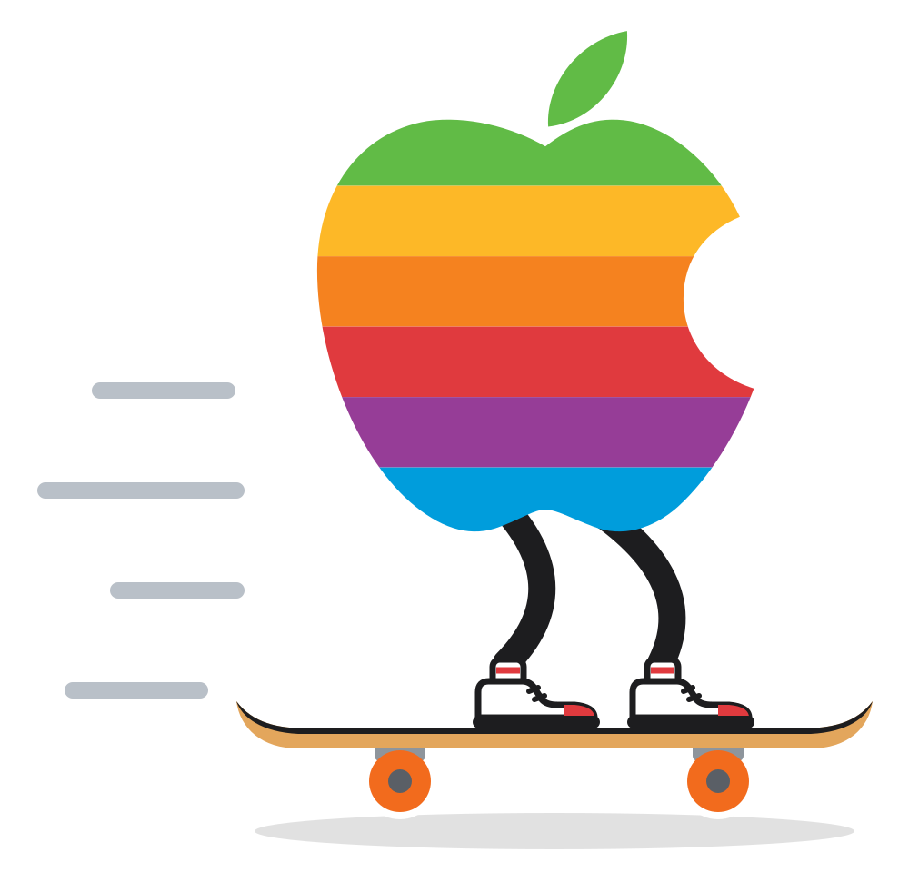

<p align="center">
  
</p>

# Skate 3 Rust Engine for macOS

A native Apple Silicon fork of
[Skate 3 Rust Engine](https://github.com/SK8-ENGINE/skate-3-rust-engine), the
Rust and Bevy reimplementation of Skate 3 built from reverse-engineering
research. It renders through Metal and reads controllers through Apple's
GameController framework. It includes skating, tricks, grinds, offboard
movement, difficulty settings and `.skate` map support; parity with the
original game is still a work in progress.

This fork is macOS-only and runs from source. For Windows, use the upstream
project.

## Play

You need an Apple Silicon Mac and your own copy of Skate 3 for **Xbox 360**:
its `.iso` disc image or extracted game folder (the PS3 version cannot be
converted). Then:

```sh
git clone https://github.com/grovebit/skate-3-macos.git
cd skate-3-macos
./play.sh
```

The first run offers to install anything missing (Xcode Command Line Tools,
Rust, uv), asks for your game in a Finder dialog, builds the engine and
converts the game. On an M3 Max that takes about 12 minutes, 10 of them
compiling; smaller Macs take longer. It needs about 15 GB of disk, plus the
disc's size while an `.iso` is converted. After that,
`./play.sh` starts the game in seconds, and after a `git pull` it rebuilds and
refreshes whatever changed.

Escape opens the graphics, difficulty and map settings; Option+Return toggles
fullscreen. Controllers: Xbox Wireless, DualSense, DualShock 4 or Switch Pro.
**No Skate 3 assets are included**: your converted files stay in the gitignored
`data/` folder.

[`docs/platform/macos.md`](docs/platform/macos.md) covers controller checks,
original audio, local multiplayer and platform notes.

## Repository layout

| Path | Contents |
| --- | --- |
| [`play.sh`](play.sh) | Set up, build and start the game. |
| [`crates/`](crates/README.md) | The Rust workspace: the game, recovered game logic, data formats, mods and networking. |
| [`tools/`](tools/README.md) | Python game-data conversion, audio research tools and performance analysis. |
| [`docs/`](docs/README.md) | The macOS guide, audio research, physics notes and performance records. |
| [`sdk/`](sdk/README.md) | The Lua mod SDK: API reference and example mods. |
| [`mods/`](mods/README.md) | Mods loaded by `play.sh`. |
| [`maps/`](maps/) | `format-demo.skate`, a procedural map for format tests. |
| [`scripts/`](scripts/) | The local multiplayer launcher. |
| [`vendor/`](vendor/README.md) | Patched Bevy crates. |

`data/` (your converted game), `target/` (builds) and `.local/` (tool
environments, audio library) are created locally and never committed.

## Development

```sh
cargo build               # the development build play.sh starts
cargo test --workspace    # Rust tests, including shader validation
uv pip install --python .local/venv-setup/bin/python -r tools/requirements-research.txt
.local/venv-setup/bin/python -m unittest $(git ls-files 'tools/test_*.py' \
    'tools/asset_pipeline/test_*.py' 'tools/audio/test_*.py' | sed 's/\.py$//; s#/#.#g')
```

The Python tests run in the setup environment that `play.sh` creates, which has
numpy and Pillow, after adding the research requirements (capstone and xex2).
CI runs the same tests on macOS.

## Credits

This fork builds on the upstream rewrite, which grew out of **dumbad**'s years
of Skate 3 reverse engineering
([DumbadsSkate3ModdingTools](https://github.com/Ethanw05/DumbadsSkate3ModdingTools))
and Chasm's recompilation and renderer work. AI coding tools helped turn that
research into code; credit for discovering how the game works belongs to
dumbad.

## License

Copyright (c) 2026 dumbad and the Skate 3 Rust Engine contributors. Original
code is licensed under the [GNU General Public License version 3 only](LICENSE)
(`GPL-3.0-only`). Third-party code, including the vendored Bevy crates and
`tools/vendor/`, keeps its own licenses. The bundled format-demo map is
original procedural content.

This macOS version was forked from Skate 3 Rust Engine at upstream commit
`4488651` (2026-10-03) and has been modified since; the changes are released
under the same license.

This is an unofficial project, not affiliated with or endorsed by Electronic
Arts or Apple. The license grants no rights to Electronic Arts' game code, data,
assets or trademarks, to Apple's trademarks, or to content supplied by other map
and mod authors.
